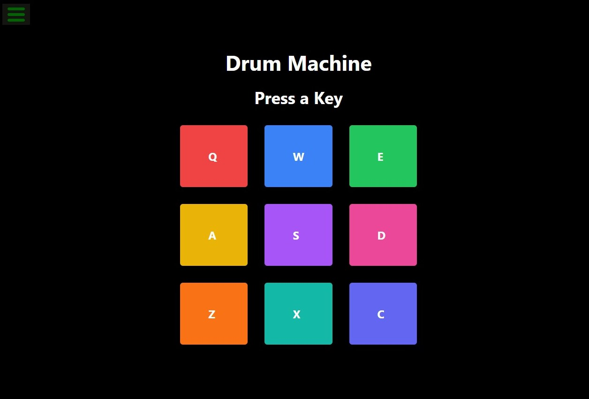

# Drum Machine
 

You can check the live dimo of project [here](https://drum-machine-ten-mocha.vercel.app/)
#### The Drum Machine is a web-based application that allows users to play different drum sounds by either clicking on the on-screen drum pads or by pressing corresponding keys on their keyboard. The app is built using React and styled with Tailwind CSS, providing an interactive and responsive user experience.

# Features
#### Responsive Design: The Drum Machine adapts to different screen sizes, ensuring a consistent experience across devices.

#### Keyboard Interactivity: Users can trigger drum sounds by pressing the keys Q, W, E, A, S, D, Z, X, and C on their keyboard.

#### Dynamic Display: When a drum pad is activated, the corresponding letter is displayed on the screen, along with a visual change to indicate the pad has been pressed.

#### Sound Playback: Each drum pad is associated with a unique sound file. When clicked or triggered via the keyboard, the sound is played instantly.

#### Visual Feedback: Active drum pads change color momentarily when pressed, enhancing user interaction and feedback.

# Technologies Used
### React: For building the user interface and managing component states.

### Tailwind CSS: For styling the application, making it visually appealing and responsive.

### JavaScript: For handling user interactions and audio playback.

# Getting Started

Prerequisites
Make sure you have the following installed:

Node.js
npm (Node Package Manager)

# How to Use
1️⃣ `creat a new repository in your github`

2️⃣  `Create a New Project Directory`

Open your terminal or command prompt. Navigate to the directory where you want to create your project. Run the following command to create a new directory for your project: bash Copy code mkdir documentation-project

3️⃣  `open HTML in any program such you want ssuch us: vscode, terminal and cmd`

4️⃣ `creat a  HTML file`

4️⃣ `creat a  javascript file`

5️⃣ `give a style to project by creating style.css file` 

6️⃣ `use (git add, git commint, git push) in the git bash to push it in Github`

7️⃣  `Make a string and uniqe project-Readme.md file`

# Technologies 
1️⃣  React: Frontend library for building the user interface.

2️⃣  Axios: For making HTTP requests to fetch quotes and images.

3️⃣  Tailwind CSS: For styling the components.

4️⃣  API Ninjas Quotes API: For retrieving quotes.

5️⃣  Pexels API: For fetching background images based on the selected category.

# Author 🔵✅
◻ Github: WALWALA SAFI (https://github.com/WALWALASAFI/product-landing-page.git)

◻ Linkedin:  walwala safi (https://www.linkedin.com/in/walwala-safi-65b56530a/)

◻ Email: walwala safi (walwalasafi99@gmail.com)
